# 图书管理系统 — 时序图文档

## 文档信息

| 项目 | 内容 |
|------|------|
| 项目名称 | 图书管理系统 |
| 文档版本 | v1.0 |
| 编制日期 | 2026-07-04 |
| 作者 | 详细设计师 |
| 文档类型 | 时序图文档 |
| 图表格式 | Mermaid |
| 参考文档 | 架构设计文档 v1.0, 接口设计文档 v1.0, 数据库设计文档 v1.0, 需求规格说明书 v1.0 |

---

## 1. 用户认证流程

### 1.1 用户登录时序图

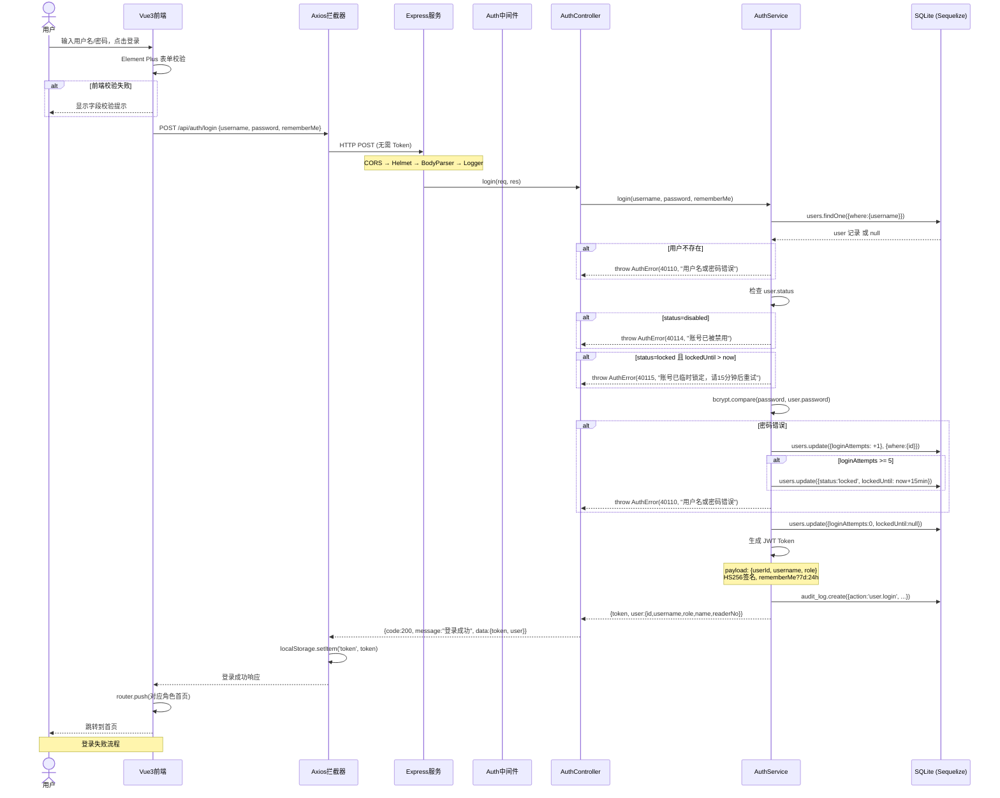

### 1.2 Token 校验与刷新时序图

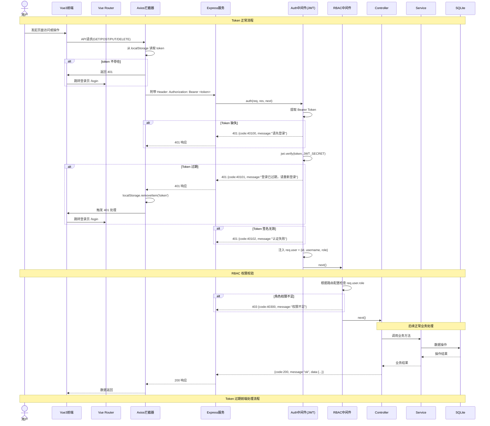

---

## 2. 图书管理流程

### 2.1 图书入库时序图

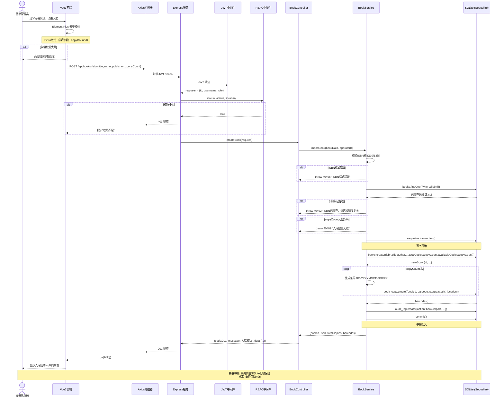

### 2.2 图书检索时序图

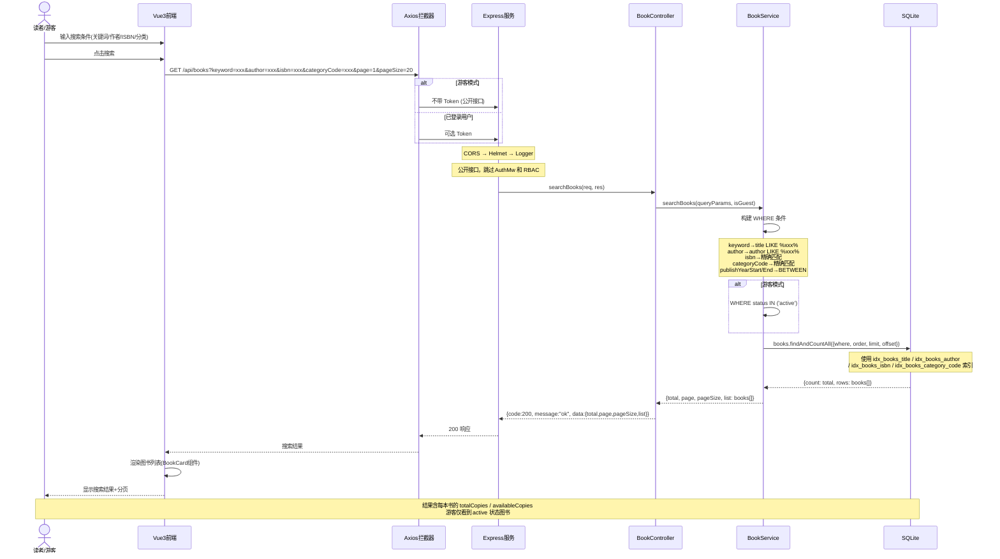

---

## 3. 借阅管理流程

### 3.1 借书时序图（核心流程）

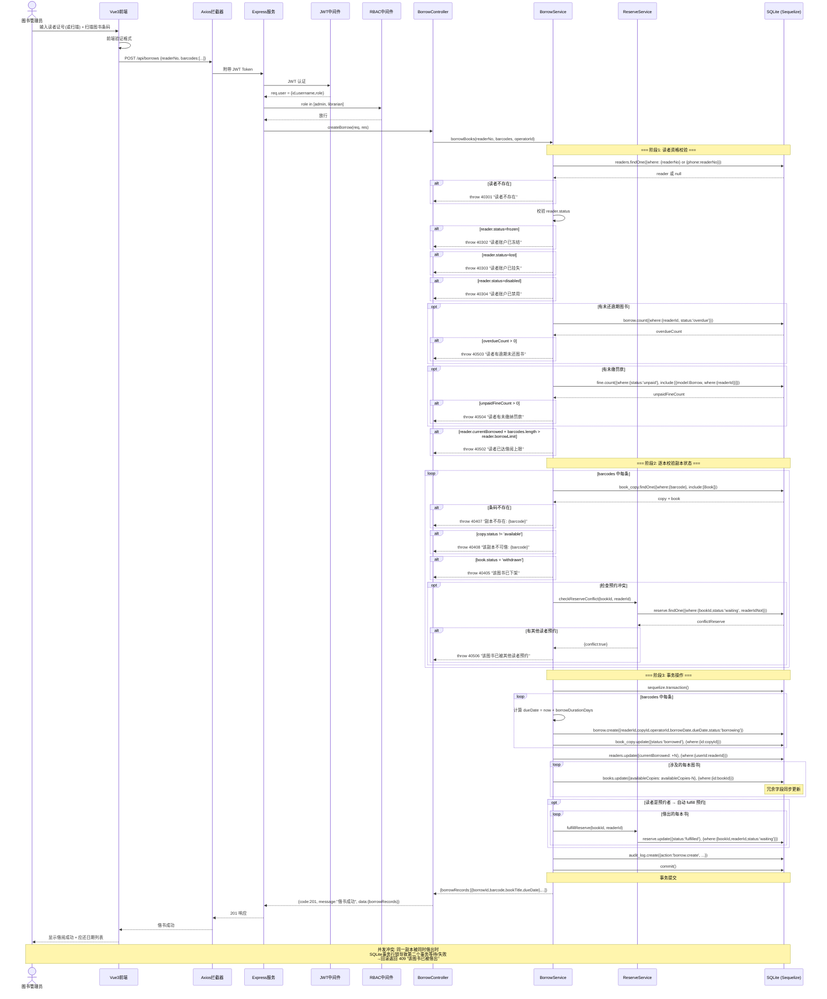

### 3.2 还书时序图

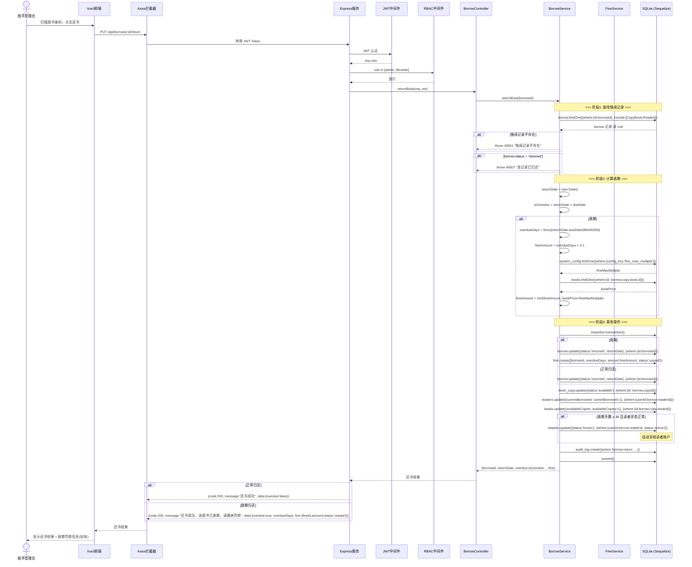

### 3.3 续借时序图

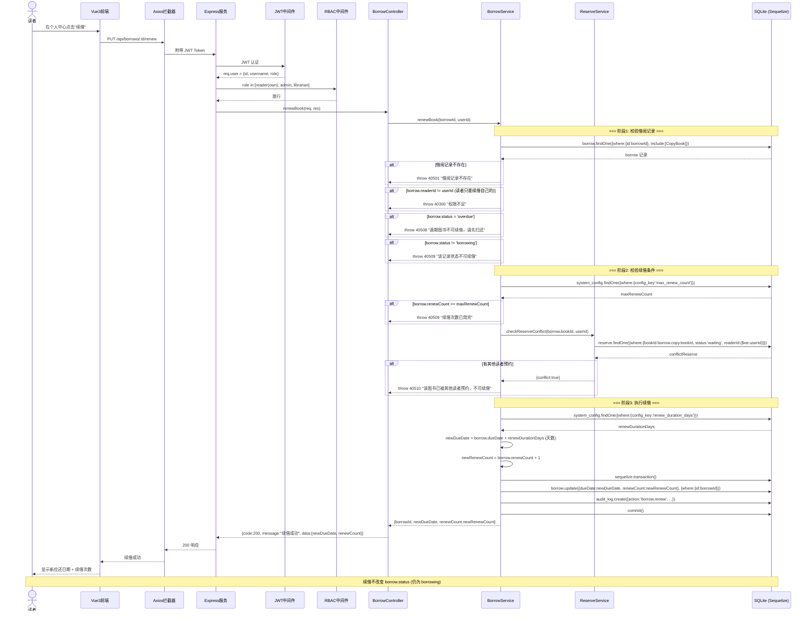

---

## 4. 逾期处理流程

### 4.1 逾期检测与罚款生成时序图（定时任务）

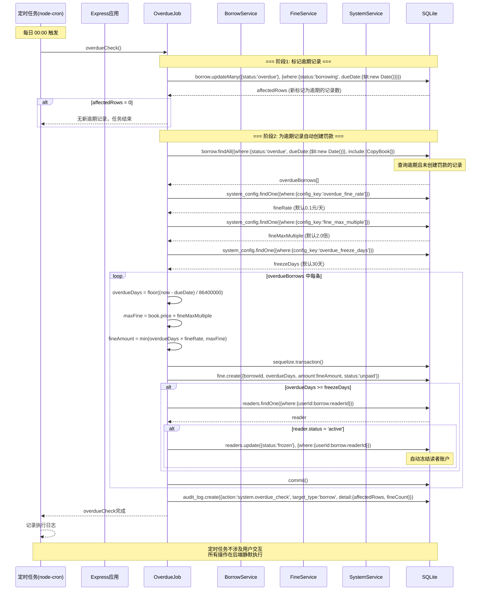

### 4.2 罚款缴纳时序图

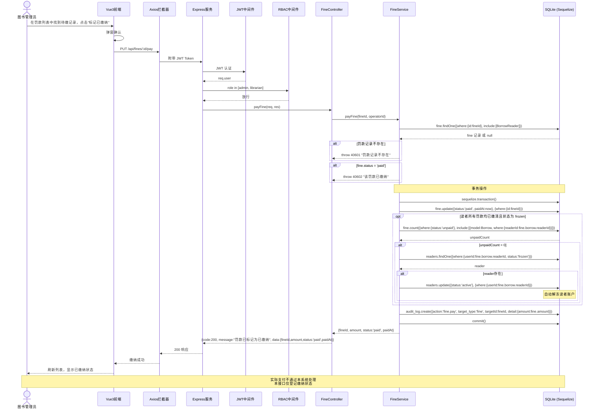

---

## 5. 读者管理流程

### 5.1 读者注册时序图

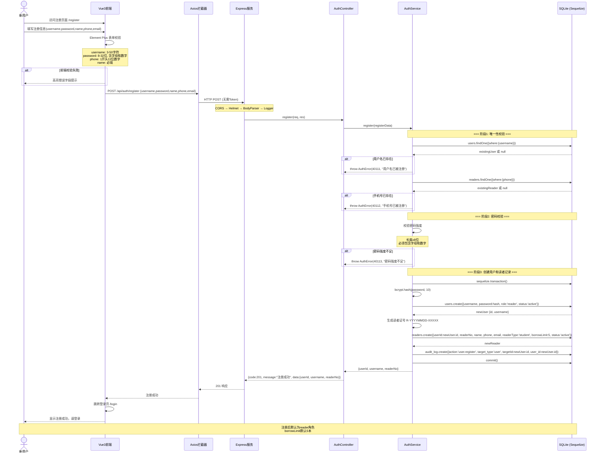

### 5.2 借阅历史查询时序图

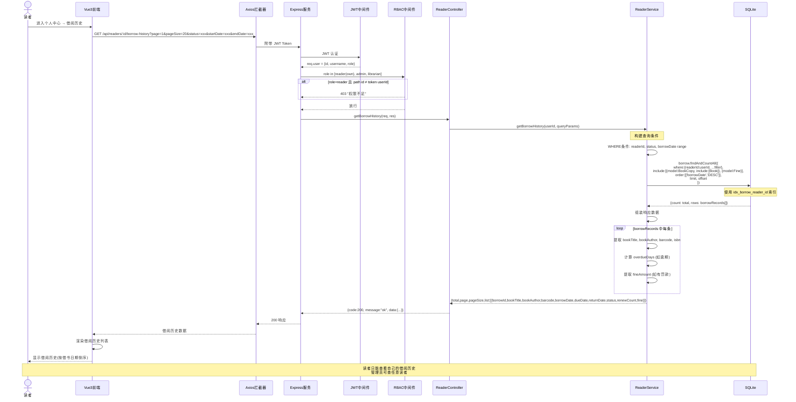

---

## 6. 预约管理流程

### 6.1 预约图书时序图

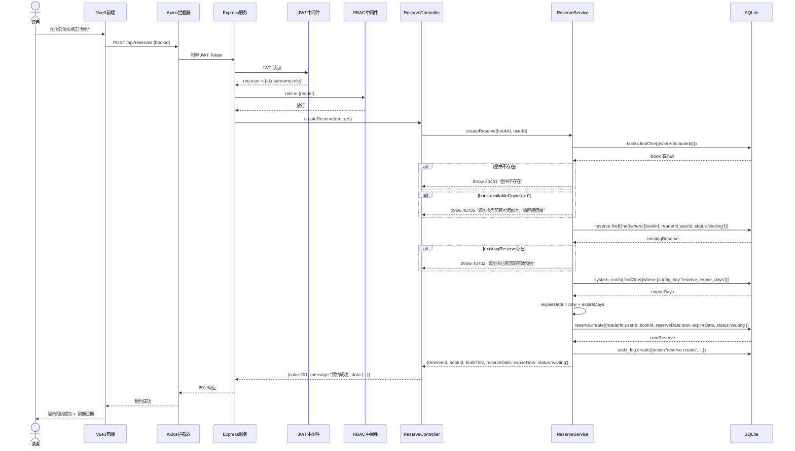

---

## 附录 A: 参与者与组件对照表

| 时序图参与者 | 对应架构组件 | 说明 |
|-------------|-------------|------|
| Vue3前端 | client/src/ | Vue 3 SPA，Element Plus UI |
| Axios拦截器 | client/src/utils/request.ts | HTTP 请求/响应拦截器，Token 注入 |
| Express服务 | server/src/app.js | Express 应用入口，中间件管道 |
| Auth中间件(JWT) | server/src/middleware/auth.js | JWT 解析与用户身份注入 |
| RBAC中间件 | server/src/middleware/rbac.js | 基于角色的权限校验 |
| AuthController | server/src/controllers/auth.controller.js | 认证相关路由处理 |
| AuthService | server/src/services/auth.service.js | 认证业务逻辑 |
| BookController | server/src/controllers/book.controller.js | 图书管理路由处理 |
| BookService | server/src/services/book.service.js | 图书管理业务逻辑 |
| BorrowController | server/src/controllers/borrow.controller.js | 借阅管理路由处理 |
| BorrowService | server/src/services/borrow.service.js | 借阅管理业务逻辑 |
| FineController | server/src/controllers/fine.controller.js | 罚款管理路由处理 |
| FineService | server/src/services/fine.service.js | 罚款管理业务逻辑 |
| ReserveController | server/src/controllers/reserve.controller.js | 预约管理路由处理 |
| ReserveService | server/src/services/reserve.service.js | 预约管理业务逻辑 |
| ReaderController | server/src/controllers/reader.controller.js | 读者管理路由处理 |
| ReaderService | server/src/services/reader.service.js | 读者管理业务逻辑 |
| SQLite (Sequelize) | server/src/models/ | ORM 模型层 + SQLite 数据库 |
| 定时任务(node-cron) | server/src/jobs/overdueCheck.js | 逾期检测定时任务 |

---

## 附录 B: 数据模型速查

### 核心表关系

```
users  1:1  readers
users  1:N  audit_log
users  1:N  borrow (operator_id)
readers 1:N borrow
readers 1:N reserve
books  1:N  book_copy
books  1:N  reserve
book_copy 1:N borrow
book_copy 1:N reserve
borrow 1:1  fine
```

### 关键状态枚举

| 表 | 字段 | 枚举值 |
|----|------|--------|
| users | status | active / disabled / locked |
| users | role | admin / librarian / reader |
| readers | status | active / frozen / lost / disabled |
| book_copy | status | stock / available / borrowed / withdrawn |
| borrow | status | borrowing / returned / overdue |
| fine | status | unpaid / paid |
| reserve | status | waiting / fulfilled / cancelled / expired |

---

## 修订记录

| 版本 | 日期 | 修订人 | 修订说明 |
|------|------|--------|---------|
| v1.0 | 2026-07-04 | 详细设计师 | 初稿，完成全部 11 个时序图 |
